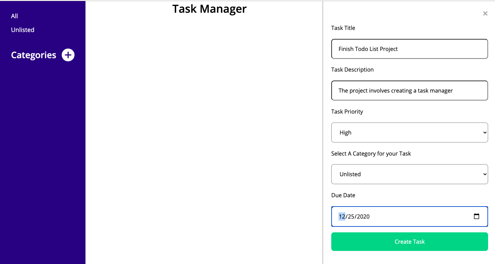

# To-do-List-

> This project involved creating a task management application where users can monitors tasks based on deadlines and priorities.

The application has the following functions

- Users can create categories to associate tasks with or used default category
- Users can create tasks
- Users can view more info about tasks, as well as update and delete tasks.
- Users can delete categories.




## Built With

- HTML
- SCSS
- Javascript
- Webpack 5.4


## Live Demo
[Try It Here](https://raw.githack.com/Maryjanee/To-do-List/app/dist/index.html)


### Prerequisites

- npm  6.14.8
- Webpack 5.4


### Setup

1. Clone this repository by using the Terminal to navigate to the desired location on your computer and then enter the following line of code into the Terminal:
```
git clone git@github.com:Maryjanee/To-do-List.git
```
2. Run `cd To-do-List` to move inside the downloaded repository.

3. The project contains a `package.json` file the manages its dependencies.Install them by running the command `npm install`


## ✒️  Authors <a name = "author"></a>

👤 **Maryjane Akpagbue**

- Github: [Maryjanee](https://github.com/Maryjanee)
- Twitter: [Maryjane Akpagbue](https://twitter.com/alfredmaryjane)
- Linkedin: [Maryjane Akpagbue](https://www.linkedin.com/in/maryjane-akpagbue)


👤 **Lucas Delbel**

- Github: [@ldelbel](https://github.com/ldelbel)
- Twitter: [@delbel_lucas](https://twitter.com/delbel_lucas)
- Linkedin: [lucasdelbel](https://www.linkedin.com/in/lucasdelbel/);


## Contributing

- To contribute to this project:
- Fork this repository & clone locally.
- Create an upstream remote and sync your local copy.
- create a new branch.
- Push your code to your origin repository.
- Create a new Pull Request .


## Show your support

Please give this project a  ⭐️ 

## Acknowledgments

- Microverse
